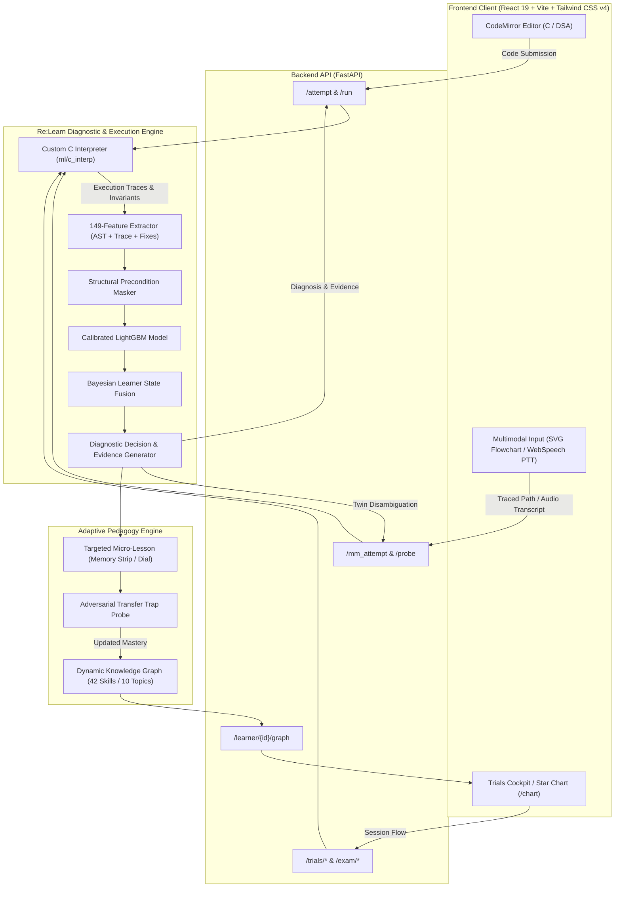

# 🌌 Re:Learn — Adaptive Multimodal Learning Environment

[](https://python.org)
[](https://fastapi.tiangolo.com)
[](https://react.dev)
[](https://typescriptlang.org)
[](https://tailwindcss.com)
[](https://lightgbm.readthedocs.io)
[](#)

> **Re:Learn** is an AI-powered adaptive learning system that identifies a student's underlying **mental model misconceptions** rather than merely marking code as correct or incorrect. Powered by a custom line-by-line C execution interpreter, Bayesian diagnostic reasoning, multimodal inputs (flowcharts & speech), and a persistent knowledge star chart, Re:Learn bridges the gap between syntactic evaluation and genuine conceptual understanding.

---

## 🎯 The Problem

Traditional Learning Management Systems (LMS) and automated grading platforms evaluate code through a binary lens: **`Passed`** or **`Failed`**.
Even modern adaptive platforms typically scale problem difficulty rather than adjusting *how* a concept is taught.

```
❌ Traditional Grader:
   Test Case 3 Failed: Expected [1, 2, 3], Got [1, 2, 2] ➔ Status: Incorrect ❌

💡 Re:Learn Diagnoser:
   "Cargo Overwrite" (D03) at 94% Confidence ➔ 
   You assigned a[j] = a[j+1] before caching the original value in a temp variable, 
   overwriting your data during the swap.
```

When students submit failing code:
1. **Identical errors can stem from fundamentally different misconceptions** (e.g. an off-by-one test failure can be caused by *Boundary Drift* or *1-based Array Index Confusion*).
2. **Showing the right answer does not fix faulty mental models.** Students often memorize syntax without grasping execution mechanics.
3. **Correct follow-up answers can be accidental passes.** Without targeted adversarial probes, systems mistake superficial fixes for true mastery.

---

## 🚀 Key Innovations & Features

### 1. 🔍 Custom C Interpreter & Line-by-Line Tracing (`ml/c_interp/`)
Rather than treating student code as a black box with GCC, Re:Learn features a built-in C interpreter in Python that executes code step-by-step:
* Records exact variable mutations, scope entries, and condition evaluations.
* Tracks pointer manipulations, recursion call stacks, and loop iterations.
* Extracts execution invariant violations to feed into downstream machine learning models.

### 2. 🧠 Bayesian Misconception Diagnoser (`ml/model/`, `ml/features/`)
* **149 Multi-Modal Features**: Combines AST structural properties, runtime trace invariants, mutation relations, and automated hypothesis-repair features.
* **Precondition Structural Masking**: Impossible classes are logically masked out before inference (e.g. recursion bugs are never predicted on non-recursive code).
* **Novelty Detection (kNN)**: Automatically flags unknown bugs or out-of-distribution code anomalies instead of forcing false classifications.
* **Temperature-Calibrated Probabilities**: Produces reliable confidence scores backed by Bayesian priors updated with the student's historical trajectory.

### 3. 👥 Twin Disambiguation & Active Probing (`TWIN_SETS`)
When two distinct misconceptions produce indistinguishable behavior on a standard test suite (e.g., `M01: Boundary Drift` vs `M08: Index Origin Fault`), Re:Learn halts automated guessing and dynamically generates an **Active Probe**:
* Displays a minimal execution scenario.
* Asks the learner to predict the internal state.
* The probe's response mathematically separates the twin likelihoods, driving diagnostic confidence from 50/50 ambiguity to over 90%.

### 4. 🎙️ Multimodal Missions (`web/src/screens/missions/`)
Learning isn't limited to typing in a code box:
* **Level A — Shield Relay (Flowchart Execution Trace)**:
  * Interactive SVG graph execution model (`SignalGateWorld`).
  * Real-time **Path Divergence Visualizer** that compares the student's traced logic branch (`n1 → n2 → n4`) against truth (`n1 → n2 → n3 → n4`) and explains condition branch slips.
* **Level B — Astronaut ID Search (Voice Algorithm Trace)**:
  * **Push-to-Talk** audio recording with browser speech recognition.
  * Voice signal analysis: response latency, hedge-word frequency count ("maybe", "probably", "I think"), and natural language algorithm explanation.
  * Interactive **Iteration Dial** for simulating algorithm loop cycles.

### 5. 🗺️ Persistent Star Chart: The Knowledge Graph of C (`/chart`)
* **42 Skill Stars across 10 Constellations** representing introductory C programming and fundamental Data Structures & Algorithms.
* Real-time adaptive star states:
  * `Cleared`: Completed with validated mastery.
  * `Shaky`: The skill is cleared, but an active linked misconception poses a high relapse risk.
  * `Risk Halo`: Uncleared skill where an unaddressed misconception is predicted to cause failures.
  * `Suggested Next`: Information-theoretic recommendation for the most informative next learning step.

### 6. ⚔️ Deep Space Trials (Timed Cockpit Exams & PDF Debrief)
* Full timed exam environment simulating competitive coding and exam conditions.
* Real-time diagnostic telemetry, trace visualizer panel, and code workspace.
* Comprehensive **Debrief Report** compiling detected misconceptions and personalized practice sectors, downloadable as a PDF via `jsPDF`.

### 7. 🛡️ Adversarial Transfer Traps (Verification of Resolution)
After an intervention teaches the corrected concept, Re:Learn does **not** assume the student has learned. It triggers a **Transfer Trap**:
* An adversarial test case designed specifically to test if the original misconception still lingers.
* Transitions learner state through: `UNSEEN` ➔ `ACTIVE` ➔ `TREATING` ➔ `PROBATION` ➔ `STABLE` / `MASTERED`.

---

## 📊 Misconception Taxonomy

Re:Learn diagnoses **17 distinct misconceptions** across two core domains:

| Code | Name | Domain | Typical Bug Signature |
|---|---|---|---|
| **M01** | *Boundary Drift* | Loops | `for (int i = 0; i <= n; i++)` (runs $n+1$ times) |
| **M02** | *Stalled Thruster* | Loops | Loop variable never updated inside body (infinite loop) |
| **M03** | *Memory Wipe* | Accumulation | Initializing running sum `int total = 0;` *inside* the loop |
| **M04** | *Fraction Shear* | Types | Integer division `int / int` truncating decimal values |
| **M05** | *Static Signal* | Variables | Reading variables before explicit initialization |
| **M06** | *Sensor Overwrite* | Logic | Accidental assignment in condition: `if (x = 5)` instead of `==` |
| **M07** | *Ghost Semicolon* | Syntax/Flow | Stray semicolon: `if (condition); { body }` |
| **M08** | *Index Origin Fault* | Arrays | Treating 0-indexed arrays as 1-indexed (`a[1]` to `a[n]`) |
| **M09** | *Copy Module* | Functions | Assuming pass-by-value modifies arguments in caller |
| **M10** | *Silent Messenger* | Functions | Calling `printf()` instead of returning value with `return` |
| **D01** | *Premature Abort* | Searching | Linear search returning -1 on the first mismatch in loop |
| **D02** | *Frozen Window* | Binary Search | `low = mid` without `+ 1` causing infinite cycle |
| **D03** | *Cargo Overwrite* | Sorting | Swapping elements without temp: `a[j] = a[j+1]; a[j+1] = a[j];` |
| **D04** | *Single Pass Hold* | Sorting | Assuming a single bubble-sort pass fully sorts an array |
| **D05** | *Endless Warp* | Recursion | Missing or unreachable base case |
| **D06** | *Static Warp* | Recursion | Recursive step does not move arguments toward base case |
| **D07** | *Lost Echo* | Recursion | Ignoring return value of recursive call (`rec(n-1);` instead of `return rec(n-1);`) |
| **D08** | *Signal Mismatch* | Strings | Comparing strings using `str1 == str2` instead of `strcmp` |

---

## 🔬 Experimental Evaluation & Scientific Rigor

The system was validated through 18 empirical evaluation benchmarks (`ml/eval/`):

```
       E01 (Grouped 5-Fold CV)  ───────►  Macro-F1: 0.827 ± 0.094
       E02 (Holdout Problems)   ───────►  Macro-F1: 0.799 (Zero-Shot on Unseen Problems)
       E04 (Realistic Code)     ───────►  Macro-F1: 0.783 (Realistic Student Stand-In)
       E11 (Perturbation Test)  ───────►  100% Invariance to Renaming & Spacing Rewrites
       E16 (Natural Language)   ───────►  Multilingual NLP: Evaluated on English & Hinglish
```

### Comparative Baselines (`E08`)
| Model Architecture | Macro-F1 (E1 Folds) | Macro-F1 (E2 Holdout) | Macro-F1 (E4 Realistic) |
|---|:---:|:---:|:---:|
| Majority Class Baseline | 0.026 | 0.035 | 0.017 |
| TF-IDF + Logistic Regression | 0.439 | 0.419 | 0.463 |
| TF-IDF + LightGBM | 0.484 | 0.451 | 0.353 |
| Static Rule Engine | 0.826 | 0.664 | 0.697 |
| **Re:Learn Diagnoser (Full)** | **0.827** | **0.799** | **0.783** |

---

## 🏗️ System Architecture



---

## 📁 Repository Structure

```
├── ml/                         # Core Machine Learning & Intelligence Engine
│   ├── c_interp/               # Custom C interpreter & step-by-step trace harness
│   ├── contracts/              # Shared schemas, class IDs (M01-M10, D01-D08), feature names
│   ├── data/                   # Concept graphs, quiz items, benchmark datasets (6,700+ samples)
│   ├── features/               # AST, execution trace, relational, and fix feature extractors
│   ├── generate/               # Synthetic program generator & mutation operator registry
│   ├── model/                  # LightGBM classifier, temperature calibration, kNN novelty
│   ├── learner/                # Persistent concept graph builder, Bayesian belief tracker
│   ├── eval/                   # Benchmark cards (E01-E18), cross-validation, baseline comparisons
│   └── text/                   # NLP sentence reader (Bi-encoder, TF-IDF, Hinglish analysis)
├── server/                     # Backend Service (FastAPI)
│   ├── app/                    # Live route controllers
│   │   ├── routes/             # attempt, trials, learner, graph, mm_attempt, quiz, exam
│   │   ├── conditions_rules.py # Deterministic diagnostic scoring for conditions
│   │   ├── loops_rules.py      # Deterministic diagnostic scoring for loop invariants
│   │   └── dsa_rules.py        # Diagnostic scoring for sorting/searching/recursion
│   └── fixtures/               # Seeded mock data and API route fallback fixtures
├── web/                        # Modern Frontend (React 19, TypeScript, Tailwind CSS v4)
│   ├── src/
│   │   ├── components/mm/      # PushToTalk, FlowchartView, PathReplay, IterationDial
│   │   ├── components/trials/  # Cockpit layout, trace visualizer, CodeMirror editor
│   │   ├── screens/missions/   # FlowchartTraceMission, VoiceTraceMission
│   │   ├── screens/            # StarChartScreen, DiagnosisScreen, TrialsExamScreen
│   │   ├── lib/                # API client, audio synthesizer, PDF debrief generator
│   │   └── store/              # Client-side mission state management (Zustand)
├── docs/                       # Dataset cards, exploratory data analysis (EDA), specifications
├── notes/                      # Comprehensive engineering logs for each work package
├── scripts/                    # Automated audit scripts & utility tools
└── tests/                      # Extensive test suite (interpreters, models, routes, contracts)
```

---

## ⚡ Quickstart Guide

### Prerequisites
* **Python 3.11+** (Python 3.12 recommended)
* **Node.js 18+** and **npm**

### 1. Clone & Setup Backend
```bash
git clone https://github.com/arnavmahajan630/ShellShock_maharashtra_round.git
cd ShellShock_maharashtra_round

# Create virtual environment
python3 -m venv .venv
source .venv/bin/activate  # On Windows: .venv\Scripts\activate

# Install dependencies
pip install -r requirements.txt
```

### 2. Start the Backend API Server
```bash
# Runs FastAPI on http://localhost:8000
python -m uvicorn server.app.main:app --host 0.0.0.0 --port 8000
```
* Interactive API Documentation: [http://localhost:8000/docs](http://localhost:8000/docs)
* Route Status Check: [http://localhost:8000/_routes](http://localhost:8000/_routes)

### 3. Launch Frontend Client
```bash
cd web
npm install
npm run dev
```
Open [http://localhost:5173](http://localhost:5173) in your browser.

---

## 🎮 Interactive Live Demo Walkthrough

### Scenario A: Real-Time Misconception Diagnosis
1. Navigate to **Loops Planet** ➔ Mission `P01` (*fire_shots*).
2. Paste this classic off-by-one boundary bug:
   ```c
   void fire_shots(int n) {
       for (int i = 0; i <= n; i++) {
           fire();
       }
   }
   ```
3. Click **Run** ➔ Tests fail ➔ Click **Continue**.
4. **Result**: The engine intercepts the loop trace and immediately diagnoses **"Boundary Drift" (M01)** at **75% confidence**: *"Off by exactly one pass of the loop."*

### Scenario B: Deep Space Trials (DSA Exam Cockpit)
1. Navigate to `/trials/exam` (or click **Trials** from the navigation bar).
2. On Trial 3 (`bubble_sort`), enter an in-place swap without a temporary variable:
   ```c
   void bubble_sort(int a[], int n) {
       for (int i = 0; i < n - 1; i++) {
           for (int j = 0; j < n - 1 - i; j++) {
               if (a[j] > a[j + 1]) {
                   a[j] = a[j + 1];
                   a[j + 1] = a[j];
               }
           }
       }
   }
   ```
3. Click **Run Samples**.
4. **Result**: Diagnoser flags **"Cargo Overwrite" (D03)** at **94% confidence** in real time mid-exam.
5. Finish the exam to view your full **Debrief Report** and export it as a clean PDF!

### Scenario C: Star Chart Inspection
1. Open [http://localhost:5173/chart](http://localhost:5173/chart).
2. Explore 42 interconnected skills in C. Notice how skills shift dynamically from *Unexplored* to *Cleared*, *Shaky*, or display a glowing *Risk Halo* based on active diagnosed misconceptions!

---

## 🧪 Testing & Verification

Run the full automated test suite covering the interpreter, feature extraction, models, and API routes:

```bash
# Run all tests
pytest tests -q

# Run specific domain test suites
pytest tests/K1 -q   # Concept graph and Star Chart tests
pytest tests/S1 tests/S2 tests/S3 -q  # API endpoint and state machine tests
pytest tests/E-a -q  # Machine learning evaluation suite
```

---

## 🛠️ Tech Stack Summary

* **Frontend**: React 19, TypeScript, Vite, Tailwind CSS v4, Framer Motion, CodeMirror (C/C++), jsPDF, Zustand.
* **Backend**: FastAPI, Uvicorn, Pydantic, NumPy, SciPy, LightGBM, ONNX Runtime.
* **Interpretation & Execution**: Pure-Python custom AST parser & execution harness (`ml/c_interp`).
* **Evaluation & Benchmarks**: 18 empirical evaluation cards (`E01`–`E18`), cluster bootstrapping, ablation studies, and Mohler benchmark validation.

---
