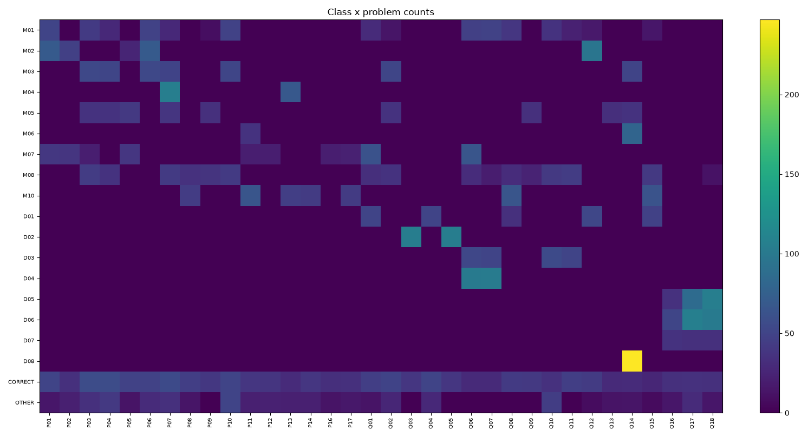
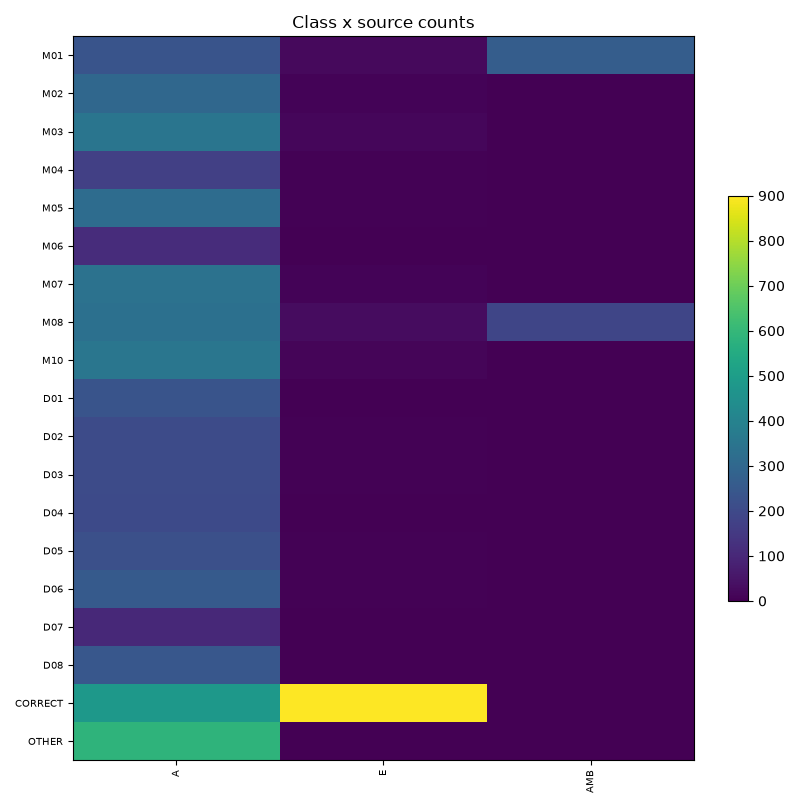
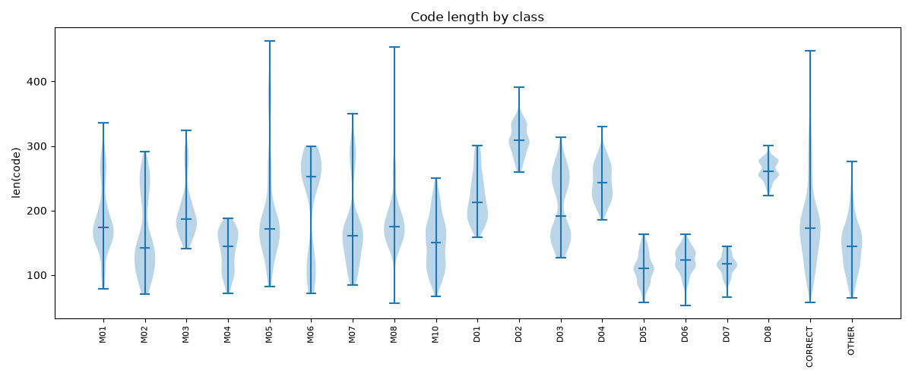
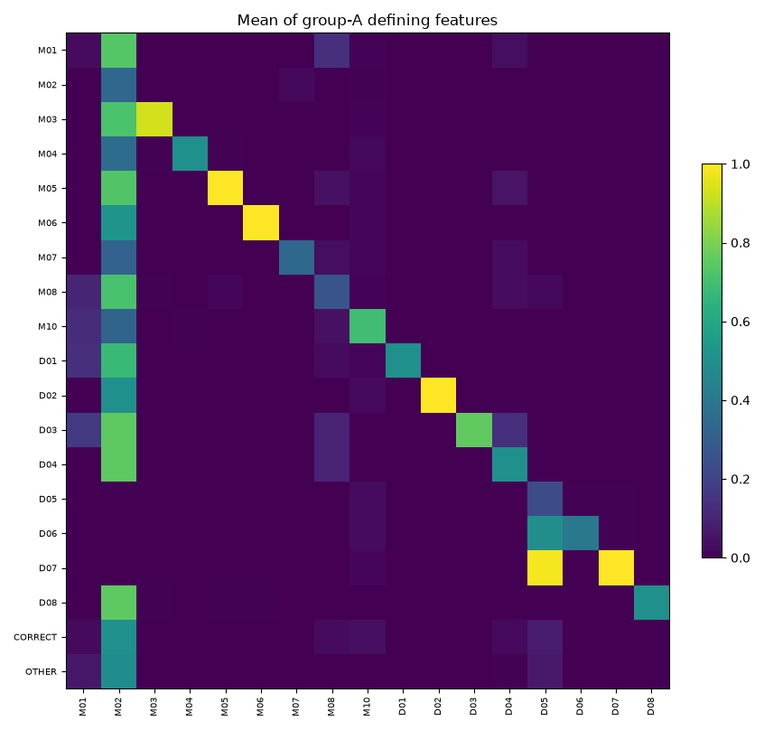
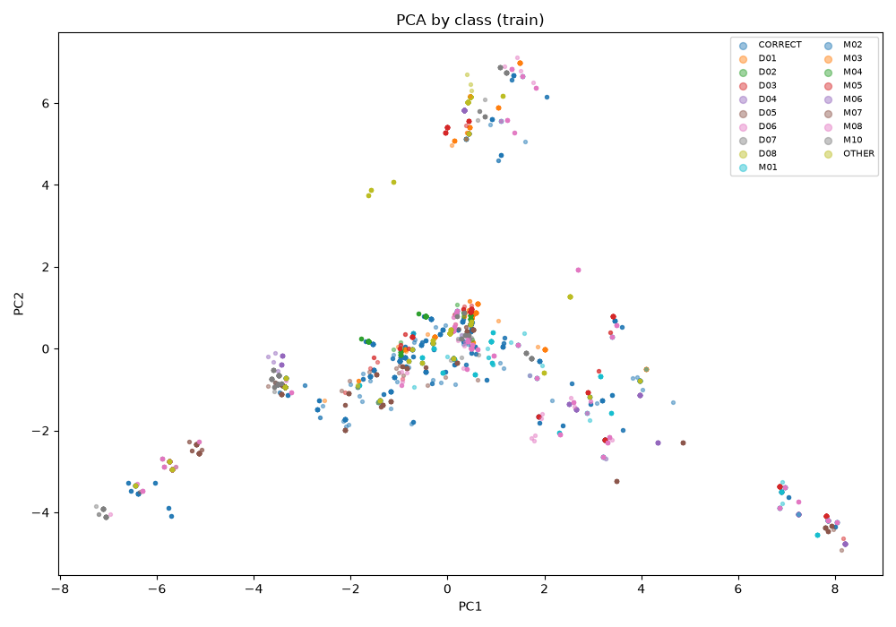
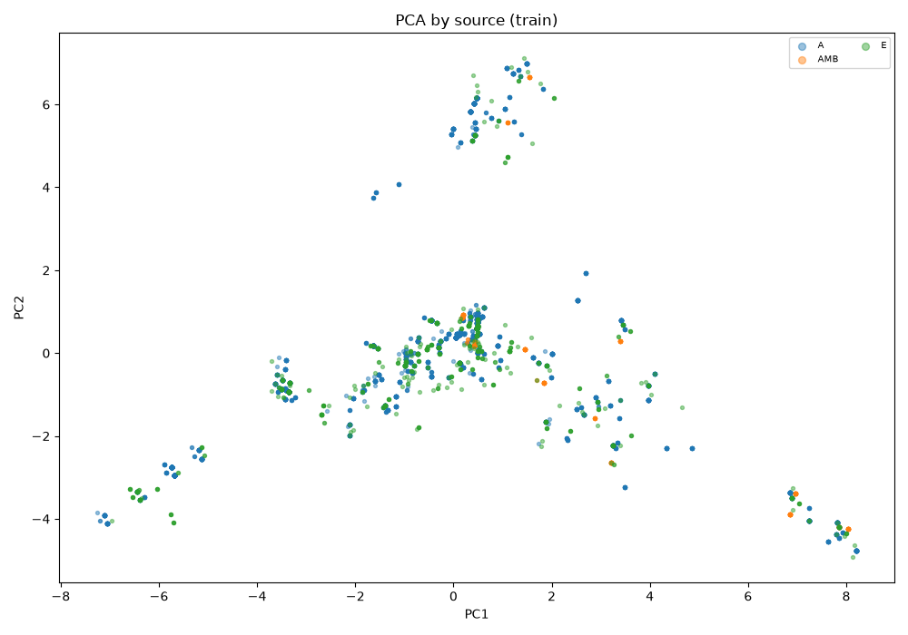
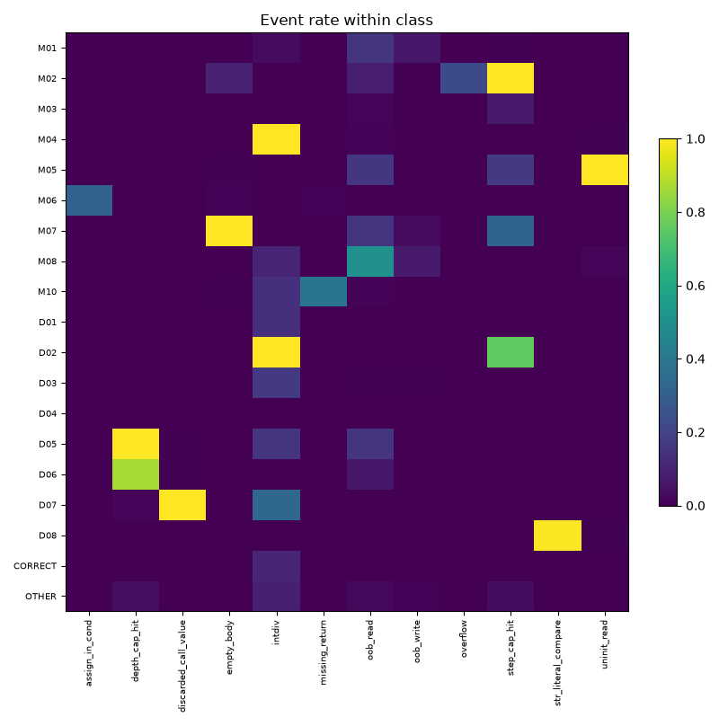
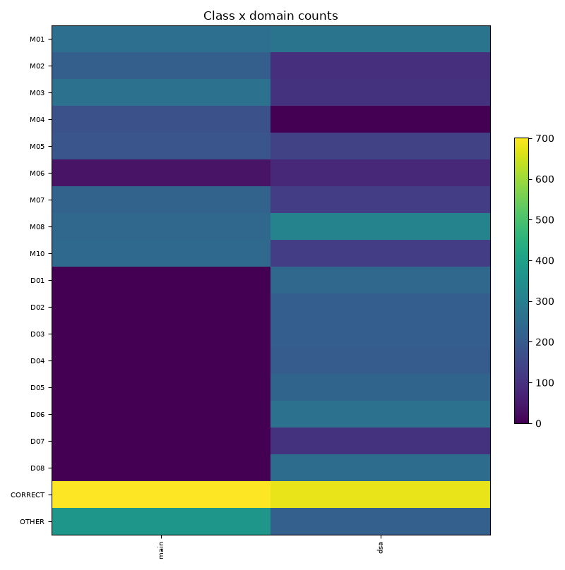

# EDA

Generated by `python -m ml.eda` from `ml/data/dataset.jsonl` (03 §10).

## Scope

Rows: **6753**. Train rows (`split=train`): **5815**. Feature matrix: **98** columns, group A then group C. AST parse failures: **0**.

Group B and group R are not computed. A dataset row stores `trace_summary` (status, event names, `loop_iters_delta`), not the trace those features read. Re-running the interpreter on every row is not part of this package.

Stumps, feature health, PCA, and IsolationForest use train rows. Counts, hashes, length, events, exposure, and masking use every row.

Plots are under `ml/eda/figures/`. `docs/eda/*.png` is not written: the only `docs/` file this package writes is `docs/eda.md`.

UMAP is not installed. PCA is the projection.

## How a rule is scored

Cutoffs written in 03 §10 are used as stated. Where §10 names the check and not the number, the bar used in this file is below. The same text is in `notes/N1.md`.

- **10.1** Fail if any of the 19 labels has fewer than 80 rows.
- **10.2** Attempt count is the number of operator sites on allowed correct variants (the generator's attempt loop, without re-running the interpreter). The file is after selection, so unique unaugmented base rows are a lower bound on mutants that passed verification. Lower bound on drop rate = unique passes-by-luck / attempts. Upper bound = (attempts − unique base rows) / attempts. Fail when the lower bound is greater than 0.40. Pass when the upper bound is at most 0.40. Otherwise the operator is inconclusive. Luck and kept keys that are the same mutant are removed from both counts. Counts that sum past the attempt total are inconsistent.
- **10.3** Fail when an `ast_hash` has more than one label and the label set is not exactly {M01, M08}.
- **10.4** Stumps are depth-1 trees, one feature at a time, on `split=train`. Macro-acc is the unweighted mean recall over classes present in that split. A non-defining feature trips the rule when macro-acc or overall accuracy is greater than 0.60. Defining means the name is in `CLASS_DEFINING_FEATURES` for some class. Length uses `len(code)`. A class separates from CORRECT when both sides have at least 20 rows, the two-sample KS statistic is at least 0.25, and p < 0.01. §10 does not name the KS cutoff. The pass/fail uses every CORRECT row. A second KS, against CORRECT rows on the same problems only, is reported and does not change the status.
- **10.5** A cell is the mean, over rows of the row-class, of the per-row mean of the column-class's defining features that sit in group A. Group B and R defining features are omitted. Fail when any off-diagonal cell is greater than 0.3.
- **10.6** Train rows, groups A and C. Constant means at most one finite value. Near-constant means the most common finite value covers at least 99% of finite rows. Correlation is pairwise-complete Pearson. Fail when any constant, near-constant, or pair with absolute correlation above 0.95 is present.
- **10.7** Adversarial validation is a binary LightGBM (grouped CV, 2 threads) on groups A and C only. The target is synthetic train versus the external file. Class labels of the external rows are not read. Fail when the out-of-fold AUC is greater than 0.85. The interval is a 95% group bootstrap of that AUC (1,000 resamples of `problem_id`). The R-llm file is an LLM-written stand-in for R-team, not hand-written. R-blind is not read. ITSP is a second comparison against the same bar and does not replace the R-llm verdict.
- **10.8** PCA on median-imputed, standardised train features after constant columns are dropped. Fail (look at features) when the silhouette of one row per `ast_hash` is at least 0.20. Below that is the heavy overlap §10 expects. 1-NN label agreement on those rows is reported and is not the pass/fail number: copies of one template sit next to each other even when the class clouds overlap. UMAP is not installed.
- **10.9** IsolationForest, contamination 0.02, `random_state=0`, on the same train matrix. No numeric fail bar. Status is INSPECT.
- **10.10** A row counts once per event name in `trace_summary.events`. Fail unless at least 50% of `oob_read` rows are label M08 or source AMB, at least 50% of `uninit_read` rows are label M05, and both events occur. §10 says "concentrate" without a fraction.
- **10.11** Cohen's kappa needs a second rater on R-team or R-blind. Those rows are not in this file.
- **10.12** For each DSA problem and each authored exposure class, empirical = unaugmented non-two-bug rows in `dataset.jsonl` with that label and `tests_failed > 0`, divided by those plus passes-by-luck rows with that label. Fail when the absolute gap is greater than 0.3. A class with no emitted mutant is listed and not compared.
- **10.13** Fail when `ml.model.mask.allowed_classes` on group A zeroes the row's true label. Domain counts have no numeric bar.

## Red rules

| # | Rule | Status | Number |
| --- | --- | --- | --- |
| 10.1 | any class < 80 rows | PASS | minimum is D07 = 104 (floor 80) |
| 10.2 | operator drop > 40% | FAIL | proven drop > 40%: 1; inconclusive: 4; proven <= 40%: 47; no sites: 4; kept/luck key overlap: 0 |
| 10.3 | hash collision other than {M01, M08} | PASS | 1845 unique hashes / 6753 rows = 0.2732; bad collisions = 0; allowed {M01, M08} hashes = 57 |
| 10.4 | non-defining stump macro-acc or accuracy > 0.60, or code length separates a class from CORRECT | FAIL | Stumps: no non-defining stump over 0.60; highest is a_init_inside_loop macro-acc 0.101 accuracy 0.244 (defining). Length: 13 classes separate from all CORRECT on code length; 6 classes also separate from CORRECT on the same problems; max KS D = 0.859 (D02) |
| 10.5 | off-diagonal bleed > 0.3 | FAIL | 17 off-diagonal cells > 0.3; max 0.986 (D07 rows, D05 features) |
| 10.6 | drop constants; keep one of each correlated pair | FAIL | 17 constant, 10 near-constant (mode share >= 99%), 9 pairs with absolute correlation above 0.95 |
| 10.7 | adversarial AUC > 0.85 | PASS | LLM-written stand-in for R-team, not hand-written. R-llm AUC 0.646 (95% CI 0.564 to 0.729) not over 0.85; ITSP AUC 0.882 (95% CI 0.801 to 0.942) over 0.85 |
| 10.8 | classes overlapping heavily is expected; otherwise look at features | PASS | silhouette -0.405 < 0.20 (heavy overlap, expected); 1-NN label agreement on 1558 unique train hashes = 0.849; PCA variance 0.132 + 0.089 |
| 10.9 | inspect the top 20; no numeric fail bar | INSPECT | top 20 of 5815 train rows (contamination 0.02, lowest score -0.0407) |
| 10.10 | oob_read concentrates in M08/AMB; uninit_read in M05 | PASS | oob_read 351/565 = 0.621; uninit_read 324/334 = 0.970 (bar 0.50) |
| 10.11 | kappa < 0.6 | SKIP | R-team rows in dataset.jsonl = 0, R-blind = 0, rows with rater2_label = 0; kappa not computed |
| 10.12 | absolute gap between empirical and authored e_ik > 0.3 | FAIL | 20 of 52 cells have absolute gap > 0.3; max 0.600 at Q01 M07 (empirical 1.000, authored 0.400) |
| 10.13 | any masked true label | PASS | 0 / 6753 rows have the true label masked. Domain main=2901 dsa=3852 |

## 10.1 Counts

**Rule.** any class < 80 rows

**PASS.** minimum is D07 = 104 (floor 80)

| class | rows | under 80 |
| --- | --- | --- |
| M01 | 526 | no |
| M02 | 309 | no |
| M03 | 365 | no |
| M04 | 174 | no |
| M05 | 324 | no |
| M06 | 116 | no |
| M07 | 351 | no |
| M08 | 550 | no |
| M10 | 369 | no |
| D01 | 237 | no |
| D02 | 210 | no |
| D03 | 210 | no |
| D04 | 205 | no |
| D05 | 227 | no |
| D06 | 261 | no |
| D07 | 104 | no |
| D08 | 247 | no |
| CORRECT | 1381 | no |
| OTHER | 587 | no |

Two-bug rows: 149 (2.2%). Soft-label rows: 577 in 191 groups.

| label set | groups |
| --- | --- |
| D01 | 2 |
| D03 | 6 |
| D04 | 1 |
| D05 | 5 |
| D06 | 6 |
| D07 | 2 |
| D08 | 3 |
| M01 | 35 |
| M01+M08 | 57 |
| M02 | 9 |
| M03 | 9 |
| M04 | 4 |
| M05 | 7 |
| M06 | 2 |
| M07 | 8 |
| M08 | 24 |
| M10 | 11 |

Class × source:

| class | A | E | AMB |
| --- | --- | --- | --- |
| M01 | 235 | 24 | 267 |
| M02 | 300 | 9 | 0 |
| M03 | 350 | 15 | 0 |
| M04 | 170 | 4 | 0 |
| M05 | 317 | 7 | 0 |
| M06 | 114 | 2 | 0 |
| M07 | 341 | 10 | 0 |
| M08 | 332 | 31 | 187 |
| M10 | 355 | 14 | 0 |
| D01 | 235 | 2 | 0 |
| D02 | 204 | 6 | 0 |
| D03 | 204 | 6 | 0 |
| D04 | 203 | 2 | 0 |
| D05 | 221 | 6 | 0 |
| D06 | 255 | 6 | 0 |
| D07 | 102 | 2 | 0 |
| D08 | 244 | 3 | 0 |
| CORRECT | 481 | 900 | 0 |
| OTHER | 587 | 0 | 0 |

Non-zero class × problem cells:

| class | problem:rows |
| --- | --- |
| M01 | P01:51 P03:42 P04:28 P06:49 P07:28 P09:9 P10:49 Q01:30 Q02:14 Q06:47 Q07:49 Q08:39 Q10:36 Q11:23 Q12:17 Q15:15 |
| M02 | P01:70 P02:47 P05:26 P06:70 Q12:96 |
| M03 | P03:54 P04:52 P06:54 P07:50 P10:52 Q02:52 Q14:51 |
| M04 | P07:106 P13:68 |
| M05 | P03:36 P04:36 P05:41 P07:38 P09:34 Q02:36 Q09:34 Q13:33 Q14:36 |
| M06 | P11:36 Q14:80 |
| M07 | P01:40 P02:38 P03:21 P05:39 P11:21 P12:21 P16:21 P17:23 Q01:62 Q06:65 |
| M08 | P03:44 P04:36 P07:42 P08:35 P09:37 P10:42 Q01:33 Q02:36 Q06:31 Q07:20 Q08:31 Q09:25 Q10:41 Q11:44 Q15:41 Q18:12 |
| M10 | P08:44 P11:65 P13:46 P14:43 P17:43 Q08:65 Q15:63 |
| D01 | Q01:51 Q04:51 Q08:34 Q12:53 Q15:48 |
| D02 | Q03:105 Q05:105 |
| D03 | Q06:53 Q07:51 Q10:55 Q11:51 |
| D04 | Q06:102 Q07:103 |
| D05 | Q16:35 Q17:86 Q18:106 |
| D06 | Q16:52 Q17:107 Q18:102 |
| D07 | Q16:36 Q17:34 Q18:34 |
| D08 | Q14:247 |
| CORRECT | P01:51 P02:34 P03:57 P04:57 P05:49 P06:49 P07:55 P08:46 P09:40 P10:51 P11:39 P12:38 P13:30 P14:39 P16:33 P17:34 Q01:46 Q02:50 Q03:39 Q04:51 Q05:39 Q06:29 Q07:29 Q08:42 Q09:41 Q10:35 Q11:46 Q12:43 Q13:29 Q14:30 Q15:27 Q16:34 Q17:35 Q18:34 |
| OTHER | P01:15 P02:22 P03:34 P04:41 P05:13 P06:30 P07:34 P08:14 P10:51 P11:22 P12:23 P13:22 P14:22 P16:13 P17:16 Q01:13 Q02:27 Q04:28 Q10:45 Q12:8 Q13:13 Q14:14 Q15:7 Q16:15 Q17:30 Q18:15 |





## 10.2 Verification

**Rule.** operator drop > 40%

**FAIL.** proven drop > 40%: 1; inconclusive: 4; proven <= 40%: 47; no sites: 4; kept/luck key overlap: 0

Passes-by-luck rate per class is luck rows / (luck rows + dataset rows). That rate is not the operator drop rate.

| class | luck | dataset | luck rate |
| --- | --- | --- | --- |
| M01 | 18 | 526 | 3.3% |
| M02 | 0 | 309 | 0.0% |
| M03 | 0 | 365 | 0.0% |
| M04 | 0 | 174 | 0.0% |
| M05 | 0 | 324 | 0.0% |
| M06 | 0 | 116 | 0.0% |
| M07 | 0 | 351 | 0.0% |
| M08 | 8 | 550 | 1.4% |
| M10 | 0 | 369 | 0.0% |
| D01 | 0 | 237 | 0.0% |
| D02 | 0 | 210 | 0.0% |
| D03 | 0 | 210 | 0.0% |
| D04 | 0 | 205 | 0.0% |
| D05 | 0 | 227 | 0.0% |
| D06 | 0 | 261 | 0.0% |
| D07 | 0 | 104 | 0.0% |
| D08 | 0 | 247 | 0.0% |
| CORRECT | 0 | 1381 | 0.0% |
| OTHER | 23 | 587 | 3.8% |

Operator bounds. `fail` means the lower bound is above 40%. `pass` means the upper bound is at most 40%.

| op_id | attempts | unique kept | luck | lower | upper | verdict |
| --- | --- | --- | --- | --- | --- | --- |
| amb_le_array | 23 | 10 | 13 | 56.5% | 56.5% | fail |
| oth_wrong_var | 76 | 24 | 7 | 9.2% | 68.4% | inconclusive |
| oth_drop_stmt | 96 | 45 | 6 | 6.2% | 53.1% | inconclusive |
| oth_swap_operands | 42 | 17 | 1 | 2.4% | 59.5% | inconclusive |
| oth_flip_branch_rel | 23 | 6 | 0 | 0.0% | 73.9% | inconclusive |
| amb_pair_bound | 7 | 5 | 2 | 28.6% | 28.6% | pass |
| oth_wrong_const | 34 | 21 | 9 | 26.5% | 38.2% | pass |
| m08_iplus1 | 62 | 54 | 8 | 12.9% | 12.9% | pass |
| m01_nminus1 | 27 | 24 | 3 | 11.1% | 11.1% | pass |
| amb_start1_array | 30 | 30 | 0 | 0.0% | 0.0% | pass |
| d01_else_flag_reset | 3 | 3 | 0 | 0.0% | 0.0% | pass |
| d01_else_return | 11 | 11 | 0 | 0.0% | 0.0% | pass |
| d02_high_mid | 6 | 6 | 0 | 0.0% | 0.0% | pass |
| d02_low_mid | 6 | 6 | 0 | 0.0% | 0.0% | pass |
| d03_drop_temp | 9 | 9 | 0 | 0.0% | 0.0% | pass |
| d03_rotate_no_save | 3 | 3 | 0 | 0.0% | 0.0% | pass |
| d04_drop_outer | 6 | 5 | 0 | 0.0% | 16.7% | pass |
| d04_outer_once | 6 | 6 | 0 | 0.0% | 0.0% | pass |
| d05_drop_base | 9 | 7 | 0 | 0.0% | 22.2% | pass |
| d05_unreachable_base | 6 | 5 | 0 | 0.0% | 16.7% | pass |
| d06_grow_arg | 6 | 6 | 0 | 0.0% | 0.0% | pass |
| d06_same_arg | 9 | 9 | 0 | 0.0% | 0.0% | pass |
| d07_discard | 6 | 6 | 0 | 0.0% | 0.0% | pass |
| d08_str_literal | 15 | 15 | 0 | 0.0% | 0.0% | pass |
| m01_countdown_ge0 | 2 | 2 | 0 | 0.0% | 0.0% | pass |
| m01_half_bound | 2 | 2 | 0 | 0.0% | 0.0% | pass |
| m01_le | 2 | 2 | 0 | 0.0% | 0.0% | pass |
| m01_start1_count | 11 | 7 | 0 | 0.0% | 36.4% | pass |
| m01_while_le | 2 | 2 | 0 | 0.0% | 0.0% | pass |
| m02_drop_update | 15 | 14 | 0 | 0.0% | 6.7% | pass |
| m02_pointer_stuck | 4 | 4 | 0 | 0.0% | 0.0% | pass |
| m02_reverse | 8 | 8 | 0 | 0.0% | 0.0% | pass |
| m02_wrong_var | 3 | 3 | 0 | 0.0% | 0.0% | pass |
| m03_assign_in_loop | 23 | 23 | 0 | 0.0% | 0.0% | pass |
| m03_decl_in_loop | 23 | 23 | 0 | 0.0% | 0.0% | pass |
| m04_cast_late | 6 | 5 | 0 | 0.0% | 16.7% | pass |
| m04_drop_cast | 6 | 5 | 0 | 0.0% | 16.7% | pass |
| m05_drop_init_acc | 6 | 6 | 0 | 0.0% | 0.0% | pass |
| m05_drop_init_counter | 16 | 16 | 0 | 0.0% | 0.0% | pass |
| m05_drop_init_max | 4 | 4 | 0 | 0.0% | 0.0% | pass |
| m06_if_assign | 7 | 7 | 0 | 0.0% | 0.0% | pass |
| m07_for_semi | 13 | 13 | 0 | 0.0% | 0.0% | pass |
| m07_if_semi | 19 | 19 | 0 | 0.0% | 0.0% | pass |
| m07_while_semi | 7 | 7 | 0 | 0.0% | 0.0% | pass |
| m08_first1 | 12 | 12 | 0 | 0.0% | 0.0% | pass |
| m08_index_n | 8 | 8 | 0 | 0.0% | 0.0% | pass |
| m08_mirror | 6 | 6 | 0 | 0.0% | 0.0% | pass |
| m08_onebased | 16 | 16 | 0 | 0.0% | 0.0% | pass |
| m10_print_bool | 12 | 12 | 0 | 0.0% | 0.0% | pass |
| m10_printf_noreturn | 30 | 30 | 0 | 0.0% | 0.0% | pass |
| m10_printf_return0 | 24 | 24 | 0 | 0.0% | 0.0% | pass |
| oth_wrong_op | 15 | 11 | 0 | 0.0% | 26.7% | pass |
| d08_array_eq | 0 | 0 | 0 | n/a | n/a | no_attempts |
| m02_update_in_branch | 0 | 0 | 0 | n/a | n/a | no_attempts |
| m04_int_literal | 0 | 0 | 0 | n/a | n/a | no_attempts |
| m06_while_assign | 0 | 0 | 0 | n/a | n/a | no_attempts |

## 10.3 Duplicates

**Rule.** hash collision other than {M01, M08}

**PASS.** 1845 unique hashes / 6753 rows = 0.2732; bad collisions = 0; allowed {M01, M08} hashes = 57

`n_unique(problem, variant, op_id)` = 1282.

Largest hash groups:

| ast_hash | rows | labels | n problems |
| --- | --- | --- | --- |
| h_a05f3740d38a8355 | 16 | M05 | 1 |
| h_ddc3babb25f69398 | 16 | M03 | 1 |
| h_604912cff9b98093 | 16 | D04 | 1 |
| h_de7304ed75491875 | 15 | M07 | 1 |
| h_60d042f693207571 | 15 | M07 | 1 |
| h_cfa73487a4b8ea21 | 15 | M07 | 1 |
| h_9c118976063292b4 | 15 | M03 | 1 |
| h_eb3decdedf893a18 | 15 | M05 | 1 |
| h_a76363136cb26899 | 15 | M05 | 1 |
| h_17013fbd450dd348 | 15 | M05 | 1 |

No cross-label hash collision outside {M01, M08}.

## 10.4 Shortcut scan

**Rule.** non-defining stump macro-acc or accuracy > 0.60, or code length separates a class from CORRECT

**FAIL.** Stumps: no non-defining stump over 0.60; highest is a_init_inside_loop macro-acc 0.101 accuracy 0.244 (defining). Length: 13 classes separate from all CORRECT on code length; 6 classes also separate from CORRECT on the same problems; max KS D = 0.859 (D02)

Scored 81 features on classes M01, M02, M03, M04, M05, M06, M07, M08, M10, D01, D02, D03, D04, D05, D06, D07, D08, CORRECT, OTHER. Showing the top 25 by max(macro-acc, accuracy).

| feature | macro-acc | accuracy | defining | over 0.60 |
| --- | --- | --- | --- | --- |
| a_init_inside_loop | 0.101 | 0.244 | yes | no |
| a_str_literal_compare | 0.105 | 0.236 | yes | no |
| a_printf_in_nonvoid | 0.101 | 0.235 | yes | no |
| a_decl_noinit_read_first | 0.105 | 0.232 | yes | no |
| a_mid_assign_no_offset | 0.105 | 0.23 | yes | no |
| a_return_in_loop_else | 0.105 | 0.226 | yes | no |
| a_char_array_param | 0.101 | 0.222 | no | no |
| a_uses_terminator | 0.101 | 0.222 | no | no |
| t_has_char_array_param | 0.101 | 0.222 | no | no |
| a_swap_no_temp | 0.092 | 0.221 | yes | no |
| a_array_loop_start1 | 0.074 | 0.22 | yes | no |
| a_bound_form_other | 0.1 | 0.218 | no | no |
| a_reads_all_params | 0.068 | 0.218 | no | no |
| a_has_recursion | 0.102 | 0.218 | no | no |
| a_n_self_calls | 0.102 | 0.218 | no | no |
| a_base_case_present | 0.101 | 0.218 | yes | no |
| a_empty_body_if | 0.072 | 0.217 | yes | no |
| a_mid_like_var | 0.102 | 0.217 | no | no |
| a_empty_body_for | 0.071 | 0.215 | yes | no |
| a_array_loop_le_n | 0.067 | 0.215 | yes | no |
| a_nonvoid_missing_return | 0.072 | 0.215 | yes | no |
| a_init_form_1 | 0.07 | 0.214 | no | no |
| a_assign_in_cond | 0.105 | 0.214 | yes | no |
| a_index_i_plus_1 | 0.072 | 0.214 | yes | no |
| a_swap_with_temp | 0.101 | 0.213 | no | no |

CORRECT: n=1381, median length 173.0, mean 183.4.

The status uses the KS against every CORRECT row. `same-problem D` is the same test restricted to problems that contain the class.

| class | n | median len | KS D | p | separates | same-problem D | same-problem separates |
| --- | --- | --- | --- | --- | --- | --- | --- |
| M01 | 526 | 174 | 0.14 | 5.49e-07 | no | 0.126 | no |
| M02 | 309 | 142 | 0.256 | 4.98e-15 | yes | 0.12 | no |
| M03 | 365 | 187 | 0.303 | 6.12e-24 | yes | 0.133 | no |
| M04 | 174 | 144 | 0.389 | 1.60e-21 | yes | 0.158 | no |
| M05 | 324 | 172 | 0.11 | 0.003099 | no | 0.196 | no |
| M06 | 116 | 253 | 0.517 | 5.25e-27 | yes | 0.342 | yes |
| M07 | 351 | 161 | 0.171 | 1.21e-07 | no | 0.121 | no |
| M08 | 550 | 175 | 0.206 | 4.20e-15 | no | 0.126 | no |
| M10 | 369 | 150 | 0.2 | 1.22e-10 | no | 0.126 | no |
| D01 | 237 | 212 | 0.451 | 8.04e-38 | yes | 0.312 | yes |
| D02 | 210 | 309 | 0.859 | 1.95e-146 | yes | 0.185 | no |
| D03 | 210 | 191 | 0.282 | 2.55e-13 | yes | 0.263 | yes |
| D04 | 205 | 243 | 0.665 | 6.46e-77 | yes | 0.52 | yes |
| D05 | 227 | 110 | 0.628 | 8.37e-74 | yes | 0.289 | yes |
| D06 | 261 | 123 | 0.606 | 1.46e-76 | yes | 0.103 | no |
| D07 | 104 | 117 | 0.702 | 7.94e-48 | yes | 0.294 | yes |
| D08 | 247 | 261 | 0.8 | 5.70e-139 | yes | 0.15 | no |
| OTHER | 587 | 145 | 0.291 | 2.82e-31 | yes | 0.189 | no |



## 10.5 Predicate matrix

**Rule.** off-diagonal bleed > 0.3

**FAIL.** 17 off-diagonal cells > 0.3; max 0.986 (D07 rows, D05 features)

Diagonal (mean of the class's own group-A defining features):

| class | diagonal mean |
| --- | --- |
| M01 | 0.03 |
| M02 | 0.335 |
| M03 | 0.932 |
| M04 | 0.5 |
| M05 | 1 |
| M06 | 1 |
| M07 | 0.335 |
| M08 | 0.261 |
| M10 | 0.695 |
| D01 | 0.5 |
| D02 | 1 |
| D03 | 0.757 |
| D04 | 0.5 |
| D05 | 0.227 |
| D06 | 0.4 |
| D07 | 1 |
| D08 | 0.5 |

Group-A features used / trace features not in this matrix:

| class | used | not in matrix |
| --- | --- | --- |
| D01 | a_return_in_loop_else, a_assign_in_loop_else | b_return_first_iter, r_eq_first_check_only, r_eq_last_check_only |
| D02 | a_mid_assign_no_offset | b_window_frozen |
| D03 | a_swap_no_temp | b_multiset_changed, r_eq_shift_without_wrap |
| D04 | a_outer_bound_const1, a_single_loop_with_swap | r_eq_one_pass, b_n_outer_passes_ratio, b_sorted_frac |
| D05 | a_base_case_present, a_base_case_static_reachable | b_depth_cap |
| D06 | a_rec_arg_form_same, a_rec_arg_form_plus1 | b_depth_cap, b_rec_arg_constant, b_rec_arg_growing |
| D07 | a_rec_call_discarded | b_discarded_call_value, r_eq_top_frame_only |
| D08 | a_str_literal_compare, a_array_name_compare | b_str_literal_compare, b_array_compare |
| M01 | a_half_bound | b_iter_delta_const_pm1, b_iter_delta_mean, r_eq_reversed_twice |
| M02 | a_update_present, a_update_dir, a_update_var_is_cond_var, a_update_in_branch | b_step_cap |
| M03 | a_init_inside_loop | r_eq_ref_last_only |
| M04 | a_int_div_into_float, a_cast_wraps_division, a_float_literal_in_div | b_intdiv_trunc_nonzero, b_intdiv_into_float, r_eq_floor_ref |
| M05 | a_decl_noinit_read_first | b_uninit_read, r_is_garbage |
| M06 | a_assign_in_cond | b_assign_in_cond_rt |
| M07 | a_empty_body_if, a_empty_body_for, a_empty_body_while | b_empty_body_exec, b_body_once_vs_many |
| M08 | a_index_n, a_array_loop_le_n, a_array_loop_start1, a_index_i_plus_1, a_index_const1 | b_oob_read_idx_eq_n, r_eq_ref_drop_first |
| M10 | a_printf_in_nonvoid, a_nonvoid_missing_return | b_printed_eq_ref_return |

Off-diagonal cells above 0.3:

| row class | feature class | mean |
| --- | --- | --- |
| D07 | D05 | 0.986 |
| D03 | M02 | 0.75 |
| D04 | M02 | 0.75 |
| D08 | M02 | 0.75 |
| M01 | M02 | 0.735 |
| M05 | M02 | 0.729 |
| M03 | M02 | 0.717 |
| M08 | M02 | 0.714 |
| D01 | M02 | 0.678 |
| M06 | M02 | 0.517 |
| CORRECT | M02 | 0.507 |
| D02 | M02 | 0.5 |
| D06 | D05 | 0.492 |
| OTHER | M02 | 0.486 |
| M04 | M02 | 0.353 |
| M10 | M02 | 0.321 |
| M07 | M02 | 0.314 |



## 10.6 Feature health

**Rule.** drop constants; keep one of each correlated pair

**FAIL.** 17 constant, 10 near-constant (mode share >= 99%), 9 pairs with absolute correlation above 0.95

Features in the matrix: 98. Parse failures: 0 / 6753. Max NaN rate: 0.0%.

Constant (17): a_main_cond_op_eq, a_bound_form_n_plus_1, a_outer_cond_op_gt, a_outer_cond_op_ne, a_outer_cond_op_eq, a_outer_cond_op_other, a_inner_cond_op_gt, a_inner_cond_op_ge, a_inner_cond_op_ne, a_inner_cond_op_eq, a_inner_cond_op_other, a_outer_bound_n_plus_1, a_outer_bound_other, a_float_literal_in_div (defining), a_assign_in_loop_else (defining), a_rec_arg_form_div10, a_array_name_compare (defining)

| feature | mode share | n unique | defining |
| --- | --- | --- | --- |
| a_main_cond_op_gt | 0.9942 | 2 | no |
| a_update_in_branch | 0.9955 | 2 | yes |
| a_outer_cond_op_le | 0.9998 | 2 | no |
| a_outer_cond_op_ge | 0.9993 | 2 | no |
| a_inner_cond_op_le | 0.9952 | 2 | no |
| a_cast_wraps_division | 0.9909 | 2 | yes |
| a_index_n | 0.9942 | 2 | yes |
| a_index_const1 | 0.9962 | 2 | yes |
| a_index_mirror_n_minus_i | 0.9957 | 2 | no |
| a_rec_arg_form_other | 0.9948 | 2 | no |

| feature | feature | corr |
| --- | --- | --- |
| a_has_recursion | a_n_self_calls | 1 |
| a_char_array_param | a_uses_terminator | 1 |
| a_char_array_param | t_has_char_array_param | 1 |
| a_uses_terminator | t_has_char_array_param | 1 |
| a_outer_cond_op_lt | a_n_nested_loops | 0.995 |
| a_outer_bound_const | a_outer_bound_const1 | 0.981 |
| a_inner_cond_op_lt | a_n_nested_loops | 0.971 |
| a_update_present | a_update_var_is_cond_var | 0.968 |
| a_outer_cond_op_lt | a_inner_cond_op_lt | 0.966 |

## 10.7 Distribution shift

**Rule.** adversarial AUC > 0.85

**PASS.** LLM-written stand-in for R-team, not hand-written. R-llm AUC 0.646 (95% CI 0.564 to 0.729) not over 0.85; ITSP AUC 0.882 (95% CI 0.801 to 0.942) over 0.85

LLM-written stand-in for R-team, not hand-written. Inputs are groups A and C. Labels on the external rows are dropped before the model is fit. R-blind is not read.

### R-llm

| n train | n external | AUC | 95% CI | splits | over 0.85 |
| --- | --- | --- | --- | --- | --- |
| 5815 | 58 | 0.646 | 0.564 to 0.729 | 5 StratifiedGroupKFold | no |

Top features by total split gain:

| feature | share of gain |
| --- | --- |
| a_init_inside_loop | 5.0% |
| a_return_const_only | 3.9% |
| t_returns_float | 3.9% |
| a_n_loops | 3.8% |
| a_bound_form_other | 3.6% |

Rows: 58. Problems: 25. AST parse failures: 3. Rows whose problem is in the bank: 58.

### ITSP

| n train | n external | AUC | 95% CI | splits | over 0.85 |
| --- | --- | --- | --- | --- | --- |
| 5815 | 396 | 0.882 | 0.801 to 0.942 | 5 StratifiedGroupKFold | yes |

Top features by total split gain:

| feature | share of gain |
| --- | --- |
| a_n_loops | 15.4% |
| a_decl_noinit_read_first | 14.3% |
| a_return_const_only | 8.6% |
| t_has_array_param | 7.2% |
| a_printf_in_nonvoid | 6.4% |

Path: `ml/data/external/itsp_slice.jsonl`. Rows: 396. Problems: 73. AST parse failures: 0. Signatures read from the code (not in the problem bank): 396.

| family | rows |
| --- | --- |
| itsp_lab4 | 88 |
| itsp_lab5 | 48 |
| itsp_lab3 | 46 |
| itsp_lab6 | 43 |
| itsp_lab7 | 41 |
| itsp_lab9 | 33 |
| itsp_lab11 | 28 |
| itsp_lab12 | 27 |
| itsp_lab10 | 25 |
| itsp_lab8 | 17 |

## 10.8 Projection

**Rule.** classes overlapping heavily is expected; otherwise look at features

**PASS.** silhouette -0.405 < 0.20 (heavy overlap, expected); 1-NN label agreement on 1558 unique train hashes = 0.849; PCA variance 0.132 + 0.089

Features used after dropping constants: 81. Unique train hashes: 1558. Explained variance: 0.132 + 0.089. Silhouette on the unique-hash plane: -0.405 (reported, not the pass/fail number).





## 10.9 Outliers

**Rule.** inspect the top 20; no numeric fail bar

**INSPECT.** top 20 of 5815 train rows (contamination 0.02, lowest score -0.0407)

Train rows: 5815. Varying features: 81. Score is `decision_function` (lower is more anomalous). Code is clipped to 12 lines.

### 1. `E-000741` score -0.0407 Q07 M01 op `amb_le_array+amb_start1_array` source E

```c
void selection_sort(int a[], int n)
{
  for (int i = 1; i < (n - 1); i++)
  {
    int m = i;
    for (int j = i + 1; j <= n; j++)
    {
      if (a[j] < a[m])
        m = j;
    }

    int t = a[i];
…
```

### 2. `E-000732` score -0.0369 Q06 M07 op `m07_if_semi+d04_outer_once` source E

```c
void bubble_sort(int a[], int n)
{
  for (int i = 0; i < 1; i++)
  {
    for (int j = 0; j < (n - 1); j++)
    {
      if (a[j] > a[j + 1])
        ;
      {
        int t = a[j + 1];
        a[j + 1] = a[j];
        a[j] = t;
…
```

### 3. `E-000719` score -0.0175 Q06 D03 op `d03_drop_temp+d04_outer_once` source E

```c
void bubble_sort(int a[], int n)
{
  for (int i = 0; i < 1; i++)
  {
    for (int j = 0; j < ((n - 1) - i); j++)
    {
      if (a[j] > a[j + 1])
      {
        a[j] = a[j + 1];
        a[j + 1] = a[j];
      }
    }
…
```

### 4. `A-002977` score -0.0167 Q06 D04 op `d04_outer_once` source A

```c
void bubble_sort(int a[], int n)
{
  int i = 0;
  while (i < 1)
  {
    int j = 0;
    while (j < ((n - 1) - i))
    {
      if (a[j] > a[j + 1])
      {
        int t = a[j];
        a[j] = a[j + 1];
…
```

### 5. `A-003062` score -0.0167 Q06 D04 op `d04_outer_once` source A

```c
void bubble_sort(int a[], int n)
{
  // bas itna hi
  for (int i = 0; i < 1; i++)
  {
    for (int j = 0; j < (n - 1); j++)
    {
      if (a[j] > a[j + 1])
      {
        int t = a[j + 1];
        a[j + 1] = a[j];
        a[j] = t;
…
```

### 6. `A-003065` score -0.0167 Q06 D04 op `d04_outer_once` source A

```c
void bubble_sort(int a[], int n)
{
  // yaha count badhao
  for (int i = 0; i < 1; i++)
  {
    for (int j = 0; j < (n - 1); j++)
    {
      if (a[j] > a[j + 1])
      {
        int t = a[j + 1];
        a[j + 1] = a[j];
        a[j] = t;
…
```

### 7. `A-002970` score -0.0167 Q06 D04 op `d04_outer_once` source A

```c
void bubble_sort(int a[], int n)
{
  int i = 0;
  while (i < 1)
  {
    int j = 0;
    while (j < ((n - 1) - i))
    {
      if (a[j] > a[j + 1])
      {
        int t = a[j];
        a[j] = a[j + 1];
…
```

### 8. `A-002978` score -0.0167 Q06 D04 op `d04_outer_once` source A

```c
void bubble_sort(int a[], int n)
{
  int i = 0;
  while (i < 1)
  {
    int j = 0;
    while (j < ((n - 1) - i))
    {
      if (a[j] > a[j + 1])
      {
        int t = a[j];
        a[j] = a[j + 1];
…
```

### 9. `A-003061` score -0.0167 Q06 D04 op `d04_outer_once` source A

```c
void bubble_sort(int a[], int n)
{
  // agla element dekho
  for (int i = 0; i < 1; i++)
  {
    for (int j = 0; j < (n - 1); j++)
    {
      if (a[j] > a[j + 1])
      {
        int t = a[j + 1];
        a[j + 1] = a[j];
        a[j] = t;
…
```

### 10. `A-003060` score -0.0167 Q06 D04 op `d04_outer_once` source A

```c
void bubble_sort(int a[], int n) {
  for (int i = 0; i < 1; i++) {
    for (int j = 0; j < (n - 1); j++) {
      if (a[j] > a[j + 1]) {
        int t = a[j + 1];
        a[j + 1] = a[j];
        a[j] = t;
      }
    }

  }

…
```

### 11. `A-003059` score -0.0167 Q06 D04 op `d04_outer_once` source A

```c
void bubble_sort(int a[], int n)
{
  for (int i = 0; i < 1; i++)
  {
    for (int j = 0; j < (n - 1); j++)
    {
      if (a[j] > a[j + 1])
      {
        int t = a[j + 1];
        a[j + 1] = a[j];
        a[j] = t;
      }
…
```

### 12. `A-002976` score -0.0167 Q06 D04 op `d04_outer_once` source A

```c
void bubble_sort(int a[], int n)
{
  printf("debug=true %d\n", n);
  int i = 0;
  while (i < 1)
  {
    int j = 0;
    while (j < ((n - 1) - i))
    {
      if (a[j] > a[j + 1])
      {
        int t = a[j];
…
```

### 13. `A-002975` score -0.0167 Q06 D04 op `d04_outer_once` source A

```c
void bubble_sort(int a[], int n)
{
  // yaha total add karo
  int i = 0;
  while (i < 1)
  {
    int j = 0;
    while (j < ((n - 1) - i))
    {
      if (a[j] > a[j + 1])
      {
        int t = a[j];
…
```

### 14. `A-002974` score -0.0167 Q06 D04 op `d04_outer_once` source A

```c
void bubble_sort(int a[], int n)
{
  // running total lives here
  int i = 0;
  while (i < 1)
  {
    int j = 0;
    while (j < ((n - 1) - i))
    {
      if (a[j] > a[j + 1])
      {
        int t = a[j];
…
```

### 15. `A-003064` score -0.0167 Q06 D04 op `d04_outer_once` source A

```c
void bubble_sort(int a[], int n)
{
  // loop over every element
  for (int i = 0; i < 1; i++)
  {
    for (int j = 0; j < (n - 1); j++)
    {
      if (a[j] > a[j + 1])
      {
        int t = a[j + 1];
        a[j + 1] = a[j];
        a[j] = t;
…
```

### 16. `A-002971` score -0.0167 Q06 D04 op `d04_outer_once` source A

```c
void bubble_sort(int a[], int n)
{
  // agla element dekho
  int i = 0;
  while (i < 1)
  {
    int j = 0;
    while (j < ((n - 1) - i))
    {
      if (a[j] > a[j + 1])
      {
        int t = a[j];
…
```

### 17. `A-003068` score -0.0167 Q06 D04 op `d04_outer_once` source A

```c
void bubble_sort(int a[], int n)
{
  for (int i = 0; i < 1; i += 1)
  {
    for (int j = 0; j < (n - 1); j += 1)
    {
      if (a[j] > a[j + 1])
      {
        int t = a[j + 1];
        a[j + 1] = a[j];
        a[j] = t;
      }
…
```

### 18. `A-002867` score -0.0167 Q06 D04 op `d04_outer_once` source A

```c
void bubble_sort(int a[], int n) {
  for (int i = 0; i < 1; i++) {
    for (int j = 0; j < ((n - 1) - i); j++) {
      if (a[j] > a[j + 1]) {
        int t = a[j];
        a[j] = a[j + 1];
        a[j + 1] = t;
      }
    }

  }

…
```

### 19. `A-002882` score -0.0167 Q06 D04 op `d04_outer_once` source A

```c
void bubble_sort(int a[], int n)
{
  int unused_b = 0;
  for (int i = 0; i < 1; i++)
  {
    for (int j = 0; j < ((n - 1) - i); j++)
    {
      if (a[j] > a[j + 1])
      {
        int t = a[j];
        a[j] = a[j + 1];
        a[j + 1] = t;
…
```

### 20. `A-002881` score -0.0167 Q06 D04 op `d04_outer_once` source A

```c
void bubble_sort(int a[], int n)
{
  int tmp_pad = 0;
  for (int i = 0; i < 1; i++)
  {
    for (int j = 0; j < ((n - 1) - i); j++)
    {
      if (a[j] > a[j + 1])
      {
        int t = a[j];
        a[j] = a[j + 1];
        a[j + 1] = t;
…
```

## 10.10 Trace events

**Rule.** oob_read concentrates in M08/AMB; uninit_read in M05

**PASS.** oob_read 351/565 = 0.621; uninit_read 324/334 = 0.970 (bar 0.50)

- `oob_read`: 351 / 565 in the expected bucket (62.1%)
- `uninit_read`: 324 / 334 in the expected bucket (97.0%)

| class | rows | assign_in_cond | depth_cap_hit | discarded_call_value | empty_body | intdiv | missing_return | oob_read | oob_write | overflow | step_cap_hit | str_literal_compare | uninit_read |
| --- | --- | --- | --- | --- | --- | --- | --- | --- | --- | --- | --- | --- | --- |
| M01 | 526 | 0 | 0 | 0 | 2 | 16 | 0 | 81 | 33 | 0 | 3 | 0 | 0 |
| M02 | 309 | 0 | 0 | 0 | 31 | 0 | 0 | 26 | 0 | 69 | 308 | 0 | 0 |
| M03 | 365 | 0 | 0 | 0 | 0 | 0 | 0 | 6 | 0 | 0 | 27 | 1 | 0 |
| M04 | 174 | 0 | 0 | 0 | 0 | 174 | 0 | 2 | 0 | 0 | 0 | 0 | 1 |
| M05 | 324 | 0 | 0 | 0 | 2 | 1 | 0 | 51 | 0 | 0 | 55 | 0 | 324 |
| M06 | 116 | 36 | 0 | 0 | 1 | 0 | 1 | 0 | 0 | 0 | 0 | 0 | 0 |
| M07 | 351 | 0 | 0 | 0 | 351 | 0 | 1 | 53 | 10 | 0 | 113 | 0 | 1 |
| M08 | 550 | 0 | 1 | 1 | 0 | 56 | 2 | 278 | 39 | 0 | 0 | 0 | 7 |
| M10 | 369 | 0 | 0 | 0 | 2 | 51 | 144 | 3 | 0 | 0 | 0 | 0 | 0 |
| D01 | 237 | 0 | 0 | 0 | 0 | 32 | 0 | 0 | 0 | 0 | 0 | 0 | 0 |
| D02 | 210 | 0 | 0 | 0 | 0 | 210 | 0 | 0 | 0 | 0 | 159 | 0 | 0 |
| D03 | 210 | 0 | 0 | 0 | 0 | 36 | 0 | 1 | 1 | 0 | 0 | 0 | 0 |
| D04 | 205 | 0 | 0 | 0 | 0 | 0 | 0 | 0 | 0 | 0 | 0 | 0 | 0 |
| D05 | 227 | 0 | 227 | 1 | 0 | 34 | 0 | 35 | 0 | 0 | 0 | 0 | 0 |
| D06 | 261 | 0 | 227 | 2 | 0 | 0 | 0 | 17 | 0 | 0 | 0 | 0 | 0 |
| D07 | 104 | 0 | 2 | 104 | 0 | 35 | 0 | 0 | 0 | 0 | 0 | 0 | 0 |
| D08 | 247 | 0 | 0 | 0 | 0 | 0 | 0 | 0 | 0 | 0 | 0 | 246 | 1 |
| CORRECT | 1381 | 0 | 0 | 0 | 0 | 149 | 0 | 0 | 0 | 0 | 0 | 0 | 0 |
| OTHER | 587 | 0 | 21 | 0 | 0 | 52 | 0 | 12 | 5 | 0 | 20 | 0 | 0 |



## 10.11 Realistic set

**Rule.** kappa < 0.6

**SKIP.** R-team rows in dataset.jsonl = 0, R-blind = 0, rows with rater2_label = 0; kappa not computed

The realistic set in 03 §10.11 is R-blind and R-team, with a second rater. There is no second rater, so kappa is not computed. The LLM-written stand-in for R-team, not hand-written, is scored only in 10.7, and its labels are not used here.

## 10.12 Exposure

**Rule.** absolute gap between empirical and authored e_ik > 0.3

**FAIL.** 20 of 52 cells have absolute gap > 0.3; max 0.600 at Q01 M07 (empirical 1.000, authored 0.400)

Empirical rate uses unaugmented, non-two-bug failures in `dataset.jsonl` over those plus `passes_by_luck.jsonl`. Cells with no mutant: 13.

| problem | class | authored | n fail | n luck | empirical | |gap| | over 0.3 |
| --- | --- | --- | --- | --- | --- | --- | --- |
| Q01 | D01 | 0.7 | 3 | 0 | 1 | 0.3 | no |
| Q01 | M01 | 0.7 | 4 | 2 | 0.667 | 0.033 | no |
| Q01 | M06 | 0.4 | 0 | 0 | n/a | n/a | no |
| Q01 | M07 | 0.4 | 6 | 0 | 1 | 0.6 | yes |
| Q01 | M08 | 0.7 | 7 | 0 | 1 | 0.3 | no |
| Q02 | M03 | 0.7 | 6 | 0 | 1 | 0.3 | no |
| Q02 | M05 | 0.4 | 3 | 0 | 1 | 0.6 | yes |
| Q02 | M06 | 0.4 | 0 | 0 | n/a | n/a | no |
| Q02 | M08 | 0.7 | 7 | 0 | 1 | 0.3 | no |
| Q03 | D02 | 0.7 | 6 | 0 | 1 | 0.3 | no |
| Q03 | M01 | 0.4 | 0 | 0 | n/a | n/a | no |
| Q03 | M02 | 0.4 | 0 | 0 | n/a | n/a | no |
| Q04 | D01 | 0.7 | 3 | 0 | 1 | 0.3 | no |
| Q04 | M05 | 0.4 | 0 | 0 | n/a | n/a | no |
| Q04 | M06 | 0.4 | 0 | 0 | n/a | n/a | no |
| Q05 | D02 | 0.7 | 6 | 0 | 1 | 0.3 | no |
| Q05 | M02 | 0.4 | 0 | 0 | n/a | n/a | no |
| Q05 | M04 | 0.4 | 0 | 0 | n/a | n/a | no |
| Q06 | D03 | 0.7 | 3 | 0 | 1 | 0.3 | no |
| Q06 | D04 | 0.7 | 6 | 0 | 1 | 0.3 | no |
| Q06 | M01 | 0.4 | 9 | 0 | 1 | 0.6 | yes |
| Q06 | M07 | 0.4 | 9 | 0 | 1 | 0.6 | yes |
| Q06 | M08 | 0.4 | 15 | 0 | 1 | 0.6 | yes |
| Q07 | D03 | 0.7 | 3 | 0 | 1 | 0.3 | no |
| Q07 | D04 | 0.7 | 5 | 0 | 1 | 0.3 | no |
| Q07 | M01 | 0.4 | 9 | 0 | 1 | 0.6 | yes |
| Q07 | M05 | 0.4 | 0 | 0 | n/a | n/a | no |
| Q08 | D01 | 0.7 | 2 | 0 | 1 | 0.3 | no |
| Q08 | M01 | 0.4 | 5 | 0 | 1 | 0.6 | yes |
| Q08 | M06 | 0.4 | 0 | 0 | n/a | n/a | no |
| Q08 | M08 | 0.4 | 7 | 0 | 1 | 0.6 | yes |
| Q08 | M10 | 0.4 | 12 | 0 | 1 | 0.6 | yes |
| Q09 | M05 | 0.7 | 2 | 0 | 1 | 0.3 | no |
| Q09 | M08 | 0.7 | 12 | 6 | 0.667 | 0.033 | no |
| Q09 | OTHER | 0.4 | 0 | 10 | 0 | 0.4 | yes |
| Q10 | D03 | 0.7 | 3 | 0 | 1 | 0.3 | no |
| Q10 | M01 | 0.4 | 6 | 1 | 0.857 | 0.457 | yes |
| Q10 | M08 | 0.4 | 14 | 0 | 1 | 0.6 | yes |
| Q11 | D03 | 0.7 | 3 | 0 | 1 | 0.3 | no |
| Q11 | M01 | 0.4 | 3 | 2 | 0.6 | 0.2 | no |
| Q11 | M08 | 0.7 | 11 | 0 | 1 | 0.3 | no |
| Q12 | D01 | 0.4 | 3 | 0 | 1 | 0.6 | yes |
| Q12 | M01 | 0.7 | 3 | 1 | 0.75 | 0.05 | no |
| Q12 | M02 | 0.7 | 10 | 0 | 1 | 0.3 | no |
| Q13 | M01 | 0.7 | 0 | 0 | n/a | n/a | no |
| Q13 | M02 | 0.7 | 0 | 0 | n/a | n/a | no |
| Q13 | M05 | 0.4 | 2 | 0 | 1 | 0.6 | yes |
| Q14 | D08 | 0.7 | 15 | 0 | 1 | 0.3 | no |
| Q14 | M03 | 0.4 | 10 | 0 | 1 | 0.6 | yes |
| Q14 | M05 | 0.4 | 5 | 0 | 1 | 0.6 | yes |
| Q14 | M06 | 0.4 | 5 | 0 | 1 | 0.6 | yes |
| Q15 | D01 | 0.7 | 3 | 0 | 1 | 0.3 | no |
| Q15 | D08 | 0.7 | 0 | 0 | n/a | n/a | no |
| Q15 | M08 | 0.4 | 9 | 0 | 1 | 0.6 | yes |
| Q15 | M10 | 0.4 | 15 | 0 | 1 | 0.6 | yes |
| Q16 | D05 | 0.7 | 2 | 0 | 1 | 0.3 | no |
| Q16 | D06 | 0.7 | 3 | 0 | 1 | 0.3 | no |
| Q16 | D07 | 0.7 | 2 | 0 | 1 | 0.3 | no |
| Q17 | D05 | 0.7 | 4 | 0 | 1 | 0.3 | no |
| Q17 | D06 | 0.7 | 6 | 0 | 1 | 0.3 | no |
| Q17 | D07 | 0.7 | 2 | 0 | 1 | 0.3 | no |
| Q18 | D05 | 0.7 | 6 | 0 | 1 | 0.3 | no |
| Q18 | D06 | 0.7 | 6 | 0 | 1 | 0.3 | no |
| Q18 | D07 | 0.7 | 2 | 0 | 1 | 0.3 | no |
| Q18 | M08 | 0.4 | 3 | 0 | 1 | 0.6 | yes |

## 10.13 Domain and masking

**Rule.** any masked true label

**PASS.** 0 / 6753 rows have the true label masked. Domain main=2901 dsa=3852

Main rows: 2901. DSA rows: 3852.

| class | main | dsa | other |
| --- | --- | --- | --- |
| M01 | 256 | 270 | 0 |
| M02 | 213 | 96 | 0 |
| M03 | 262 | 103 | 0 |
| M04 | 174 | 0 | 0 |
| M05 | 185 | 139 | 0 |
| M06 | 36 | 80 | 0 |
| M07 | 224 | 127 | 0 |
| M08 | 236 | 314 | 0 |
| M10 | 241 | 128 | 0 |
| D01 | 0 | 237 | 0 |
| D02 | 0 | 210 | 0 |
| D03 | 0 | 210 | 0 |
| D04 | 0 | 205 | 0 |
| D05 | 0 | 227 | 0 |
| D06 | 0 | 261 | 0 |
| D07 | 0 | 104 | 0 |
| D08 | 0 | 247 | 0 |
| CORRECT | 702 | 679 | 0 |
| OTHER | 372 | 215 | 0 |

Masked true labels: 0 / 6753 (0.0%).


